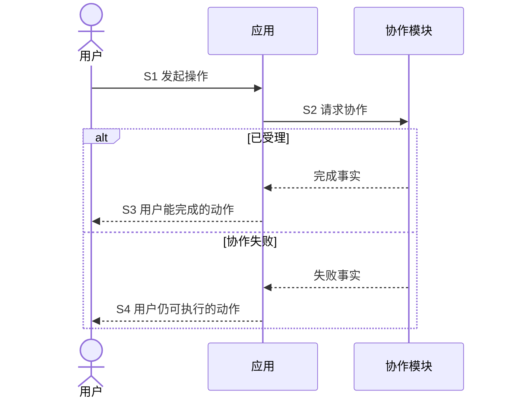

# 场景时序

默认落点：`docs/sequences/<场景>.md`。引用蓝图不变量。以终端用户语言写触发情形、期望体验和候选方案的可观察差异。

```mermaid
sequenceDiagram
    actor U as 用户
    participant A as 应用
    participant B as 协作模块
    U->>A: S1 发起操作
    A->>B: S2 请求协作
    alt 已受理
        B-->>A: 完成事实
        A-->>U: S3 用户能完成的动作
    else 协作失败
        B-->>A: 失败事实
        A-->>U: S4 用户仍可执行的动作
    end
```

按实际参与者替换示例，标出谁决定、谁执行、谁处理失败。Review 在同一步骤对应实际版本和证据。

| 步骤 | 预期体验 | 实际结果 | 一致／偏差／未验证 | 证据 |
|---|---|---|---|---|
